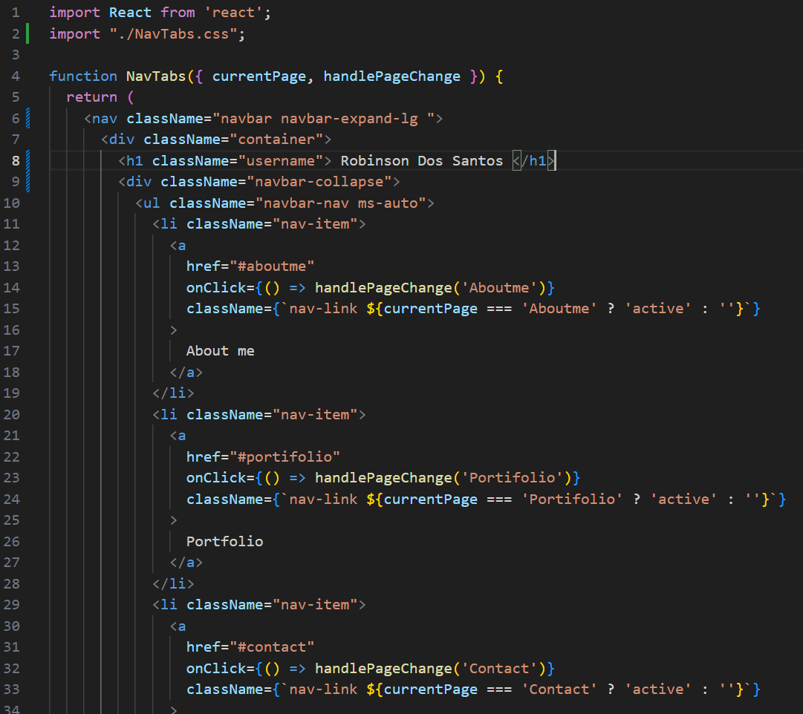

# Portfolio-REACT  

  ## Description
  This project was developed as a boot camp challenge using REACT technology, but besides the good development practice it will also can be used as an application to present my portfolio with some of the projects that were created during the boot camp.
  
  ## Table of Contents
  - [Installation](#installation)
  - [Usage](#usage)
  - [License](#license)
  - [Contributing](#contributing)
  - [Questions](#questions)
  
  ## Installation
  Navigate to https://github.com/robinsonfdossantos/Portfolio-REACT.

  Open a local built-in Terminal (powershell, bash) on your local machine.

  Navigate to a desired folder to place your project in, using 'cd "folder"'.

  Use `git clone` to copy the repository to your local computer by typing "git clone git@github.com:robinsonfdossantos/Portfolio-REACT.git".
  
  ## Usage

  To run the application make sure that you have created all the REACT required configurations.

  As bootstrap technology has been also used in the development is necessary to import the required libraries to ensure that no errors happen by running `import bootstrap/dist/css/bootstrap.min.css` in the integrate terminal.
  
  To start the application ensure that all the packages have been installed by running `npm i` or `npm install`, followed by `npm start`.

  How it is a personal private page, ensure that none of the content will be published by someone wihthout the owner's consent.

  In the illustration below shows is part of the code that you will face in this application, in this example it presents the some bootstrap framework and how navigation tabs may be configured.

  

  ## Deployment

  The application has been deployed using the Github `gh-pages`, which is a tool which works to deploy REACT applications.

  The following link represents the deployed application, where you can navigate through my application and know a bit more about myself, besides visiting my portfolio.

  `https://robinsonfdossantos.github.io/Portfolio-REACT/`

  ## License
  This application is covered under the MIT license.
  
  ## Contributing
  
  All users are very welcome to leave their comments and suggestions for improvement by sending me a direct message or creating pull requests on Github.
  
  ## Questions
  For any questions or inquiries, please reach out to me via [GitHub](https://github.com/robinsonfdossantos) or email me at robinsonfdossantos@gmail.com.